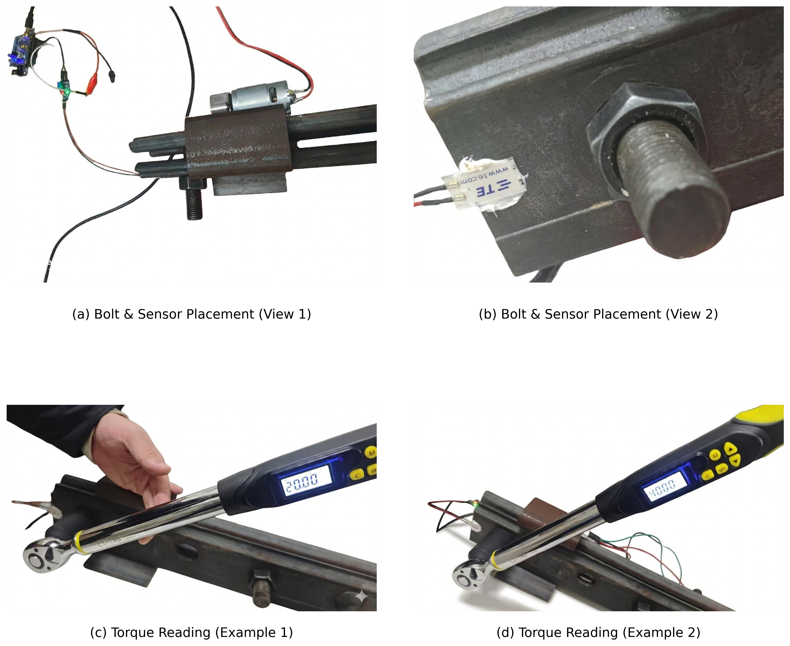

# PIR-Net

Physics-informed deep learning framework for bolt loosening detection from 1 MHz vibration signals.

## 1. Overview

This repository provides the implementation used for PIR-Net experiments and reviewer-requested external baseline comparisons. It is structured for reproducible research, controlled benchmarking, and assisted validation with an auxiliary Windows GUI.

This is not a code-only repository. A dataset archive (`data.zip`) is included and distributed through Git LFS for reproducibility and local evaluation.

## 2. Scope

This project covers three workflows:

1. PIR-Net ablation and main-model training/evaluation.
2. External baseline benchmarking without PIR-specific preprocessing.
3. Assisted validation using `BoltDetectionGUI` as a Python-bridge front-end.

## 3. Repository Structure

```text
PIRNet_OpenSource_Root/
├─ README.md
├─ LICENSE
├─ requirements.txt
├─ CONTRIBUTING.md
├─ SECURITY.md
├─ CITATION.cff
├─ docs/
│  └─ USAGE_GUIDE.md
├─ experiments/
│  ├─ pirnet_ablation/
│  └─ external_baselines/
├─ BoltDetectionGUI/
├─ tools/
│  ├─ update_data_dir.py
│  └─ smoke_test.py
├─ inference_engine.py
├─ train.py
├─ generalization.py
└─ dataset.py
```

## 4. Environment Setup

Install Python dependencies:

```bash
python -m pip install --upgrade pip
python -m pip install -r requirements.txt
```

Install PyTorch according to your hardware:

```bash
# Example (CUDA 12.8)
python -m pip install torch torchvision torchaudio --index-url https://download.pytorch.org/whl/cu128

# Example (CPU only)
python -m pip install torch torchvision torchaudio --index-url https://download.pytorch.org/whl/cpu
```

## 5. Dataset Preparation

The repository includes `data.zip` via Git LFS.

```bash
git lfs install
git lfs pull
```

Extract `data.zip` to a dataset directory containing class subfolders (default: `case1` to `case16`) with `.npy` samples.

### 5.1 Dataset Source

The uploaded `data.zip` is the processed dataset package used in the PIR-Net study.

- Source type: self-collected impact-vibration data acquired by the author using an FPGA-based acquisition system for bolted-joint experiments.
- Sampling setting: 1 MHz (see experiment configs, e.g., `data.sr = 1000000`).
- Packaging format: `.npy` files organized by `case1` to `case16`, with downstream 6-class fusion labels used by PIR-Net.
- Data ownership: collected by the repository author; not sourced from a third-party public benchmark.
- Availability: versioned in this repository via Git LFS (`data.zip`).

If you use the dataset package in derivative work, please cite this repository and the corresponding PIR-Net paper.

Representative acquisition setup (FPGA-based):



## 6. Configure Data Paths

Update all experiment configs before training:

```bash
python tools/update_data_dir.py --root . --data_dir /absolute/path/to/your/data
```

Optional:

```bash
python tools/update_data_dir.py --root . --data_dir /absolute/path/to/your/data --generalization_dir /absolute/path/to/generalization_data
```

## 7. Running Experiments

PIR-Net example (`222`):

```bash
cd experiments/pirnet_ablation/222
python train.py --exp_dir .
python generalization.py --exp_dir .
```

External baselines (`301`-`306`):

```bash
cd experiments/external_baselines
python run_baselines.py --experiments 301 302 303 304 305 306
python run_baselines.py --experiments 301 302 303 304 305 306 --with_generalization
```

## 8. Quick Reproducibility Reference

Reference acceptance ranges for sanity validation (not a substitute for full paper tables):

| Experiment Group | IDs | Expected Accuracy Range | Notes |
| --- | --- | --- | --- |
| PIR-Net ablation | 022, 122, 202, 212, 220, 221, 222 | 0.90 - 0.99 | Internal split, configured pipeline |
| External baselines | 301, 302, 303, 304, 305, 306 | 0.75 - 0.95 | No PIR-specific preprocessing |
| Generalization evaluation | Corresponding trained runs | 0.60 - 0.90 | SNR and split settings affect results |

## 9. Smoke Validation

Run lightweight repository checks with a single `python -m` command:

```bash
python -m tools.smoke_test --mode all --exp_dir experiments/pirnet_ablation/222
```

This command performs:

- import smoke checks for core modules,
- config schema validation,
- dry-run update of a copied `config.json`.

## 10. Auxiliary GUI

`BoltDetectionGUI` is an auxiliary GUI for validation and demonstration. It supports configuration management and Python-bridge execution. It is not a standalone DAQ/runtime system.

Installer assets:

- `BoltDetectionGUI/release/BoltDetection_setup.exe`
- `BoltDetectionGUI/release/SHA256SUMS.txt`

## 11. Continuous Integration

A minimal GitHub Actions workflow is provided at `.github/workflows/ci.yml`.

CI currently performs:

1. syntax lint (`python -m compileall -q .`),
2. import smoke test,
3. config dry-run smoke test.

## 12. Reproducibility Notes

- PIR-Net and external baselines are intentionally separated.
- External baselines preserve their native processing assumptions.
- Changes to split strategy or preprocessing should be documented in reports.

## 13. License

This repository is released under the MIT License. See `LICENSE` for details.

## 14. Citation

Please cite using metadata in `CITATION.cff`.
## 15. Community and Collaboration

Repository collaboration conventions are defined in:

- `CONTRIBUTING.md`
- `CODE_OF_CONDUCT.md`
- `SECURITY.md`
- `.github/ISSUE_TEMPLATE/`
- `.github/pull_request_template.md`
